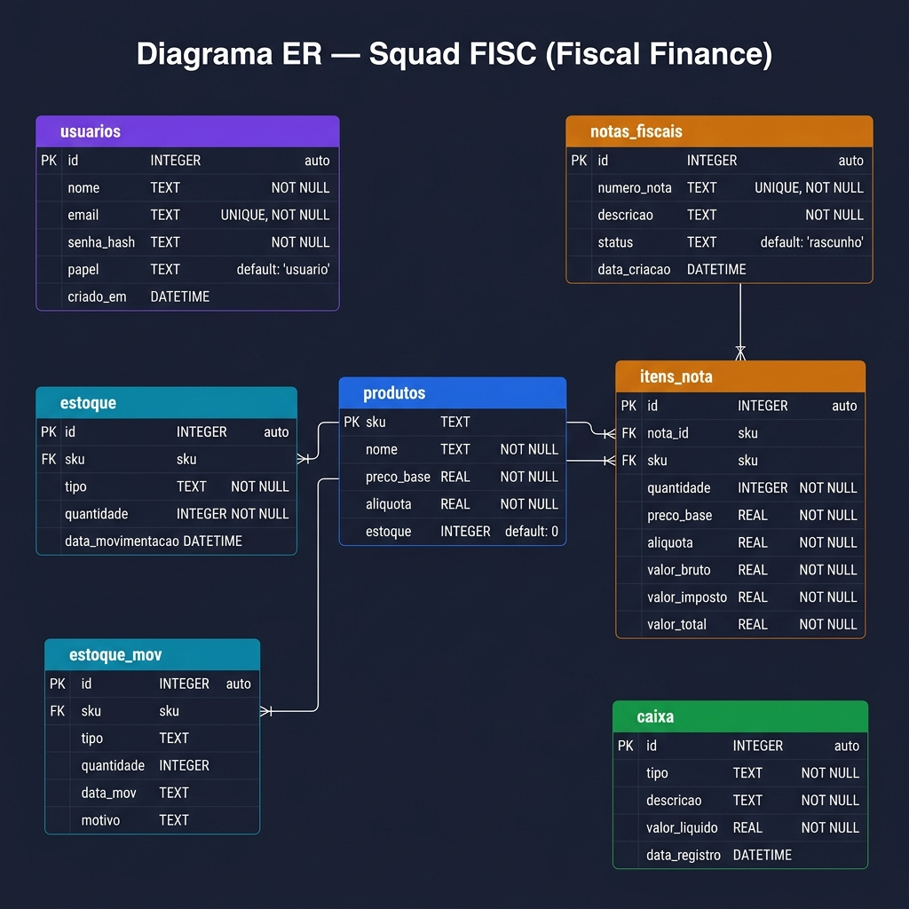

# PRD v4.6 — SQUAD FISC (Fiscal-Finance)
**Sistema Fiscal, Financeiro e Estoque Integrado**

> Versão: 4.6 | Status: Em Execução | Última revisão: 15 de Maio de 2026

---

## SUMÁRIO

1. Visão Geral
2. Problema de Negócio
3. Objetivos do Produto
4. Público-Alvo e Personas
5. Escopo do Produto (Real vs Planejado)
6. Stack Tecnológica
7. Arquitetura Técnica e Integrações
8. Fluxo Principal e Regras de Negócio
9. Modelo de Dados (ERD) e DDL
10. Roadmap de Sprints
11. Segurança e Autenticação
12. API Pública (Inter-Squads)
13. Métricas de Sucesso
14. Definição de Pronto (DoD)

---

## 1. VISÃO GERAL

O Squad FISC desenvolve o núcleo de gestão financeira, fiscal e de estoque do ERP. Diferente do planejamento inicial de uma aplicação desktop local, o sistema evoluiu para uma **Arquitetura Web Moderna baseada em APIs REST**, permitindo integração fluida entre diferentes squads e acesso centralizado via navegador.

---

## 2. PROBLEMA DE NEGÓCIO

Empresas enfrentam gargalos pela falta de sincronia entre a venda, o estoque e o financeiro. O sistema resolve isso automatizando a cadeia: **Venda → Imposto → Baixa de Estoque → Entrada no Caixa.**

---

## 3. OBJETIVOS DO PRODUTO

- **Automação Fiscal:** Cálculo de impostos (alíquota configurável por produto) em tempo real.
- **Rastreabilidade:** Histórico completo de movimentações de estoque (Entradas/Saídas).
- **Integridade Financeira:** Conciliação automática onde cada movimentação física (estoque) gera uma movimentação financeira (caixa).
- **Interoperabilidade:** Disponibilizar dados para outros squads (CRM, Service Desk) via API Segura.

---

## 4. PÚBLICO-ALVO E PERSONAS

- **Gestor Financeiro:** Analisa o `balance` e o `statement` (extrato) consolidado.
- **Operador de Estoque:** Registra compras e entradas via `/stock/entry`.
- **Vendedor / Sistema de Vendas:** Gera intenções de nota e confirma vendas via `/invoice`.
- **Service Desk (Squad 4):** Consulta histórico de movimentações para suporte ao cliente.
- **CRM (Squad 3):** Consulta saldo de estoque em tempo real para fechamento de vendas.

---

## 5. ESCOPO DO PRODUTO

### O que o sistema FAZ (Escopo Atual):
- **Gestão de Produtos:** CRUD completo com controle de SKU único e alíquotas.
- **Estoque Inteligente:** Registro de entrada com cálculo automático de custo e impacto no caixa.
- **Faturamento:** Fluxo de "Intenção de Nota" (simulação) e "Confirmação" (efetivação).
- **Fluxo de Caixa:** Fonte única de verdade (`caixa`) que consolida Receitas de Vendas, Despesas Manuais e Custos de Compra.
- **API Pública:** Autenticação via `X-API-KEY` para integração com outros sistemas do ERP.
- **Infraestrutura:** Totalmente dockerizado e com deploy automatizado via GitHub Actions.

---

## 6. STACK TECNOLÓGICA

| Componente | Tecnologia | Detalhes |
|---|---|---|
| **Linguagem** | Python 3.12 | Core da aplicação backend. |
| **Framework Web** | Flask | Servidor de APIs REST. |
| **Banco de Dados** | SQLite 3 | Armazenamento local persistente (`app.db`). |
| **Autenticação** | JWT + SHA-256 | Tokens de sessão stateless e hashing de senhas. |
| **Frontend** | Web Moderno | HTML5, CSS3, JS (Vanilla) servido pelo Flask. |
| **Documentação** | Flasgger | Swagger UI interativo disponível em `/docs`. |
| **Containerização** | Docker | Dockerfile e Docker Compose. |

---

## 7. ARQUITETURA TÉCNICA E INTEGRAÇÕES

O sistema utiliza um modelo de **Blueprints** no Flask para separar responsabilidades:
- `auth`: Gestão de sessões e usuários.
- `products`: Catálogo central.
- `stock`: Movimentações físicas.
- `invoice`: Processamento fiscal.
- `cashflow`: Gestão financeira.
- `public_api`: Porta de entrada para outros Squads.

**Integrações Externas:**
- **Squad 1 (Auth/Core):** Validação de identidade.
- **Squad 3 (CRM):** Consulta de estoque para propostas comerciais.
- **Squad 4 (Service Desk):** Acesso ao histórico de movimentações para auditoria de chamados.

---

## 8. FLUXO PRINCIPAL E REGRAS DE NEGÓCIO

### Regra de Ouro: Atomicidade
Toda confirmação de nota fiscal (`/invoice/confirm`) é uma transação atômica. Se a baixa de estoque falhar, a entrada no caixa não ocorre.

### Fluxo de Compra (Entrada):
1. Usuário envia SKU e Qtd para `/stock/entry`.
2. Sistema incrementa `produtos.estoque`.
3. Sistema registra 'entrada' em `estoque_mov`.
4. **Automático:** Sistema registra 'compra' em `caixa` com o valor total (Qtd × Preço Base).

### Fluxo de Venda (Saída):
1. Simulação via `/invoice/intent` para conferência de impostos.
2. Confirmação via `/invoice/confirm`.
3. Sistema valida saldo de estoque.
4. Sistema decrementa `produtos.estoque`.
5. Sistema registra 'saida' em `estoque_mov`.
6. **Automático:** Sistema registra 'entrada' em `caixa` com o valor final (com impostos).

---

## 9. MODELO DE DADOS (ERD)



### Definição das Tabelas (DDL)

```sql
-- Usuários e Permissões
CREATE TABLE usuarios (
    id         INTEGER PRIMARY KEY AUTOINCREMENT,
    nome       TEXT    NOT NULL,
    email      TEXT    UNIQUE NOT NULL,
    senha_hash TEXT    NOT NULL,
    papel      TEXT    NOT NULL DEFAULT 'usuario', -- admin, usuario
    criado_em  DATETIME DEFAULT CURRENT_TIMESTAMP
);

-- Produtos e Estoque Atual
CREATE TABLE produtos (
    sku        TEXT PRIMARY KEY,
    nome       TEXT NOT NULL,
    preco_base REAL NOT NULL,
    aliquota   REAL NOT NULL,
    estoque    INTEGER DEFAULT 0
);

-- Log de Movimentação de Estoque
CREATE TABLE estoque_mov (
    id         INTEGER PRIMARY KEY AUTOINCREMENT,
    sku        TEXT,
    tipo       TEXT, -- entrada, saida
    quantidade INTEGER,
    data_mov   TEXT, 
    motivo     TEXT,
    FOREIGN KEY(sku) REFERENCES produtos(sku)
);

-- Notas Fiscais Emitidas
CREATE TABLE notas_fiscais (
    id           INTEGER PRIMARY KEY AUTOINCREMENT,
    numero_nota  TEXT NOT NULL UNIQUE,
    descricao    TEXT NOT NULL,
    status       TEXT NOT NULL DEFAULT 'rascunho', -- rascunho, emitida
    data_criacao DATETIME DEFAULT CURRENT_TIMESTAMP
);

-- Detalhamento dos Itens da Nota
CREATE TABLE itens_nota (
    id            INTEGER PRIMARY KEY AUTOINCREMENT,
    nota_id       INTEGER NOT NULL,
    sku           TEXT NOT NULL,
    quantidade    INTEGER NOT NULL,
    preco_base    REAL NOT NULL,
    aliquota      REAL NOT NULL,
    valor_bruto   REAL NOT NULL,
    valor_imposto REAL NOT NULL,
    valor_total   REAL NOT NULL,
    FOREIGN KEY(nota_id) REFERENCES notas_fiscais(id),
    FOREIGN KEY(sku) REFERENCES produtos(sku)
);

-- Fluxo de Caixa (Fonte Única de Verdade)
CREATE TABLE caixa (
    id            INTEGER PRIMARY KEY AUTOINCREMENT,
    tipo          TEXT NOT NULL, -- entrada (venda), despesa (manual), compra (estoque)
    descricao     TEXT NOT NULL,
    valor_liquido REAL NOT NULL,
    data_registro DATETIME DEFAULT CURRENT_TIMESTAMP
);
```

---

## 10. ROADMAP DE SPRINTS

- **Sprint 1 & 2 (Concluídas):** Arquitetura base, Banco de Dados, Módulos Core (Produtos/Estoque) e Autenticação JWT.
- **Sprint 3 (Atual):** Desenvolvimento da Interface Web, Dashboard Financeiro e Documentação Swagger.
- **Sprint 4 (Concluída):** Dockerização e CI/CD para deploy automático em VM.
- **Sprint 5 (Planejada):** Testes de estresse, refinamento de UI e preparação da Demo Final.

---

## 11. SEGURANÇA E AUTENTICAÇÃO

- **Interna:** JWT (JSON Web Token) com expiração de 24h. Senhas protegidas por hash SHA-256.
- **Externa:** Cabeçalho `X-API-KEY` obrigatório para todos os endpoints em `/v1/public/`.
- **Banco:** Conexões seguras e proteção contra SQL Injection via uso de parâmetros em todas as queries.

---

## 12. API PÚBLICA (INTER-SQUADS)

Endpoints otimizados para consumo por outros serviços:
- `GET /v1/public/fisc/products/<sku>`: Dados básicos e saldo.
- `GET /v1/public/fisc/stock/<sku>`: Apenas saldo e última movimentação.
- `GET /v1/public/fisc/cashflow/summary`: Resumo para o dashboard consolidado do ERP.
- `GET /v1/public/fisc/history/<sku>`: Log de auditoria física.

---

## 13. MÉTRICAS DE SUCESSO

- **Zero Divergência:** O saldo do caixa deve bater 100% com as vendas e compras registradas.
- **Tempo de Deploy:** Deploy completo em menos de 3 minutos via GitHub Actions.
- **Adoção:** Todos os squads parceiros consumindo a API Pública sem erros de autenticação.

---
*PRD v4.6 — Squad FISC | Documento Oficial do Projeto*
